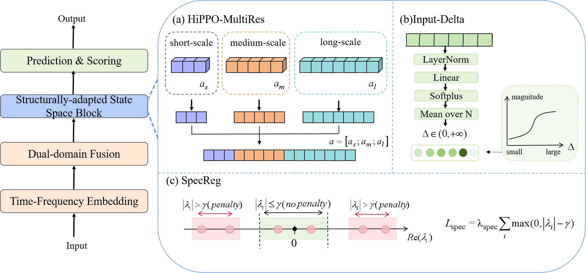
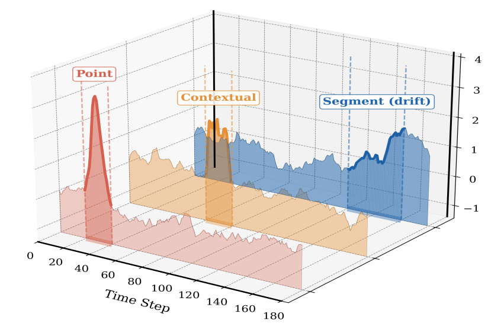
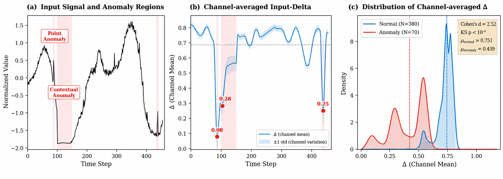

# S3AD

<p align="center">
  <strong>Structurally-adapted State Space Model for Time Series Anomaly Detection</strong>
</p>

<p align="center">
  A compact research implementation of S3AD with a unified clean-benchmark evaluation pipeline.
</p>

<p align="center">
  
</p>

<p align="center"><em>Overview of the S3AD architecture and its structurally-adapted state-space block.</em></p>

> **Release status:** public release candidate. The core code and benchmark datasets are included in this repository; the robustness experiment scripts remain withheld until the authors decide on the post-acceptance release scope.

## Highlights

S3AD adapts state-space dynamics to the requirements of time series anomaly detection through three complementary designs:

- **HiPPO-MultiRes** initializes state channels at multiple temporal resolutions.
- **Input-Delta** makes the discretization step responsive to the current input.
- **SpecReg** constrains state-spectrum drift during training to reduce channel degradation.

The implementation also includes time--frequency embedding, anomaly scoring, and a common adapter interface for baseline comparison.

## Why multi-scale memory matters

Time series anomalies can be localized, contextual, or segment-level. A detector therefore needs to retain information across different temporal ranges rather than relying on a single effective memory scale.

<p align="center">
  
</p>

<p align="center"><em>Representative point, contextual, and segment-level anomaly patterns used to motivate multi-scale temporal modeling.</em></p>

## Input-adaptive state updates

Input-Delta changes the update scale according to the observed signal. The accompanying analysis illustrates the response of the channel-averaged update scale in normal and anomalous regions.

<p align="center">
  
</p>

<p align="center"><em>Input-Delta behavior: signal regions, channel-averaged update scale, and its distribution.</em></p>

## Package scope

This package contains the core implementation and benchmark data needed to inspect and reproduce the clean benchmark pipeline:

- S3AD and its scoring utilities;
- baseline adapters for **S3AD**, **CS-LSTMs**, **KAN-AD**, and **DLinear**;
- model implementations required by those adapters;
- dataset loading, chronological splitting, normalization, and evaluation utilities;
- the benchmark datasets used by the clean experiments;
- the clean-data experiment entry point.

The following materials are intentionally withheld until the paper is accepted and the authors decide on the final release scope:

- spike, trend, variance, frequency, point-missing, and block-missing experiment scripts;
- robustness experiment runners and robustness result files;
- internal result-processing scripts;
- paper drafts, review materials, and local datasets.

See [RELEASE_SCOPE.md](RELEASE_SCOPE.md) for the complete boundary of the package.

## Repository layout

```text
.
├── s3ad.py                         # S3AD model
├── get_f1_score.py                 # Evaluation metrics
├── adapters/                       # Unified detector interfaces
├── models/                         # Core model implementations
├── experiments/
│   ├── data_pipeline.py            # Loading, splitting, normalization
│   ├── exp_clean.py                # Clean benchmark entry point
│   └── utils.py                    # Metrics and result utilities
├── assets/                         # Selected paper figures for documentation
├── data/                           # Benchmark datasets
├── requirements.txt
├── RELEASE_SCOPE.md
├── OPEN_SOURCE_CHECKLIST.md
└── LICENSE_PENDING.md
```

## Installation

We recommend Python 3.9 or newer and a clean virtual environment:

```bash
python -m venv .venv
source .venv/bin/activate
pip install -r requirements.txt
```

On Windows PowerShell:

```powershell
python -m venv .venv
.\.venv\Scripts\Activate.ps1
pip install -r requirements.txt
```

For CUDA installations, install the PyTorch wheel that matches the local CUDA version.

## Dataset preparation

The benchmark datasets used by the project are included under `data/`. The dataset layout and source notes are documented in [data/README.md](data/README.md).

The pipeline supports the dataset layouts used by the project and performs chronological train/validation/test splitting and training-set standardization.

## Running the clean benchmark

Run the clean-data experiment from the package root:

```bash
python experiments/exp_clean.py
```

To select datasets explicitly:

```bash
EXPERIMENT_DATASETS=KPI,TODS python experiments/exp_clean.py
```

On Windows PowerShell:

```powershell
$env:EXPERIMENT_DATASETS = "TODS"
python experiments/exp_clean.py
```

Results are written to `experiments/results/clean/`.

## Reproducibility note

Before the final publication package is frozen, the authors will add an appropriate license, verify dataset redistribution permissions, run the clean benchmark in a fresh environment, and remove any remaining internal metadata.

## License

No open-source license has been assigned yet. See [LICENSE_PENDING.md](LICENSE_PENDING.md). Please do not redistribute this folder until the authors publish the final license and repository.

## Citation

The citation entry will be added after the paper metadata and public repository URL are finalized.
